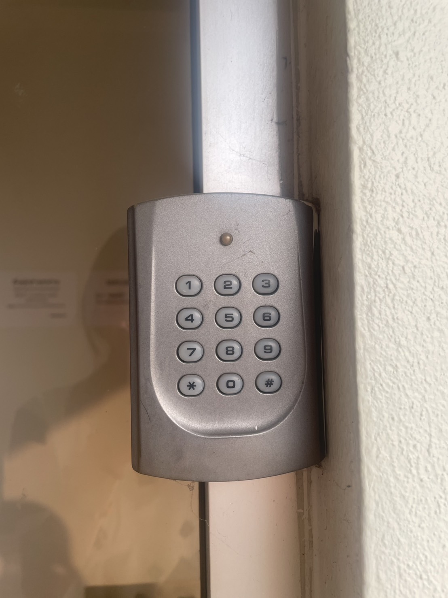

## Security-Control
## Keypad & Card Reader Access Control

- *Control Function* : Preventive Controls
-  *Type of SecurityControl* : Physical Controls

# เหตุผลที่ Control Function เป็น Preventive Controls
 - เป็นการควบคุมเชิงป้องกัน ป้องกันเหตุการณ์ที่ไม่พึงประสงค์หรือภัยคุกคามที่อาจส่งผลกระทบต่อระบบหรือองค์กรโดยมุ่งเน้นไปที่การป้องกันไม่ให้ปัญหาเกิดขึ้นตั้งแต่แรก เช่น ป้องกันการเข้าถึงโดยไม่ได้รับอนุญาต (Unauthorized Access), ป้องกันการละเมิดนโยบายด้านความปลอดภัย (Security Policy Violation)
 - ช่วยลดความเสี่ยงด้านการเข้าถึงโดยไม่ได้รับอนุญาต
 - ทำงานโดยใช้หลักการ "ป้องกันล่วงหน้า" โดยอาจอยู่ในรูปแบบของ กฎระเบียบ, มาตรการทางกายภาพ และเทคโนโลยี เช่น ต้องมีบัตรเพื่อสแกนเข้าพื้นที่, ใช้รหัสผ่านเพื่อเข้าพื้นที่

# เหตุผลที่ Type of SecurityControl เป็น Physical Controls
 - เป็นมาตรการด้านความปลอดภัยที่ใช้อุปกรณ์หรือสิ่งกีดขวางทางกายภาพเพื่อป้องกันการเข้าถึงโดยไม่ได้รับอนุญาต 
 - เป็นการป้องกันผู้ที่ไม่ได้รับอนุญาตหรือไมีมีบัตรและPIN เข้าพื้นที่
 - ในที่นี้ Keypad & Card Reader Access Control จะใช้ บัตรเพื่สแกนเข้า, ใช้PIN เพื่อเปิดประตูเข้าพื้นที่
